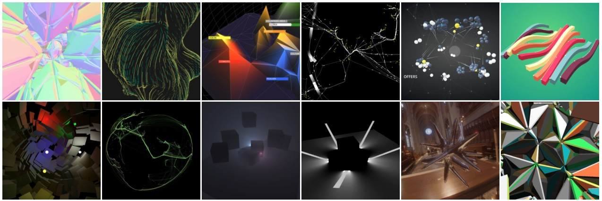

# Pex



Pex is a JavaScript/CoffeScript 3d utility library for WebGL.

Examples of use
http://marcinignac.com/experiments/technology/webgl/  
http://marcinignac.com/projects/technology/webgl/  
http://variable.io/ (All WebGL projects)  
http://www.flickr.com/photos/marcinignac/sets/72157629801608107/  

## How to start?

1. Download [latest Pex source](https://github.com/vorg/pex/archive/master.zip).
2. Download [Plask](http://plask.org).
3. Unpack .DMG and open PlaskLauncher.
4. Click File->Open and choose one of Pex examples e.g. pex-master/examples/basic/basic.js
5. You should see a cube. You can rotate it by dragging the mouse.

# How to use Pex in Plask?

1. Make sure the example from above runs
2. Create new folder
3. Copy there `pex.js` from pex-master/build/pex.js
4. Create `main.js` in the same folder and copy this code:

```JavaScript
var pex = require('pex.js');

pex.sys.Window.create({
  settings: {
    width: 1280,
    height: 720
  },
  init: function() {
    //your setup things like texture loading goes here
  },
  draw: function() {
    this.gl.clearColor(0.3,0.3,0.3,1);
    this.gl.clear(this.gl.COLOR_BUFFER_BIT);
    //your drawing code goes here
  }
});
```

5. Open main.js with PlaskLauncher.
6. You should see a window with grey background

# How to use Pex in the browser*?
1. Follow steps 1-4 from "How to use in Plask from scratch?"
2. In the same folder copy `require.js` from pex-master/build/require.js
3. Create `index.html` in the same folder with the following code:

```HTML
<!doctype html>
<html lang="en">
<head>
  <meta charset="UTF-8">
  <title>Pex</title>
  <script type="text/javascript" src="require.js"></script>
  <script type="text/javascript" src="pex.js"></script>
  <script type="text/javascript" src="main.js"></script>
</head>
<body>
</body>
</html>
```

4. Open `index.html` in the browser
5. You should see a grey rectangle

* the borwser must support WebGL in order for Pex to work.

## Using with Sublime Text

Opening and relaunching with PlaskLauncher is tedious so I [added a Build System](http://www.sublimetext.com/docs/build):

`Plask.sublime-build`

```JSON
{
  "cmd" : [
    "/path/to/PlaskLauncher.app/Contents/Resources/Plask.app/Contents/MacOS/Plask", 
    "$file"
  ]
}
```

## FAQ

**How does it compare to ThreeJS?**

[ThreeJS](http://threejs.org) is focusing on simplifying your experience with WebGL by hiding the hard parts and exposing an API that's easy to start with. It has better community support, better tools import/export support and it's well tested, solid code that you can confortably use for your production projects.

**Why did you make Pex then?**

Pex has different goals in mind. It's simplifying coding but there is more boilerplate code to be written with aim to give you more controll over what and when is happening. While ThreeJS is targetting browsers, Pex primary target is [Plask](http://plask.org). It is written in a way that works in any WebGL capable browser out of the box and even on iOS with [Ejecta](https://github.com/phoboslab/ejecta). Pex is written in a modular way with [RequireJS](http://requirejs.org), ThreeJS achieves similar goals with namespacing in Three

**What does Pex mean?**

Pex stands for PlaskExtensions as it hass started as a set of utility functions for my [Plask](http://plask.org) projects.